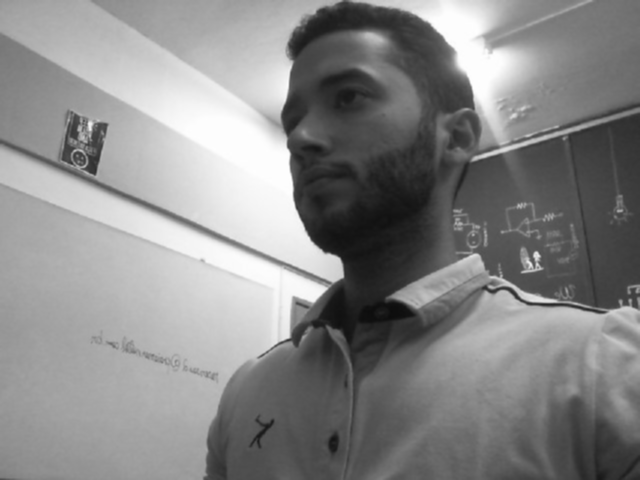
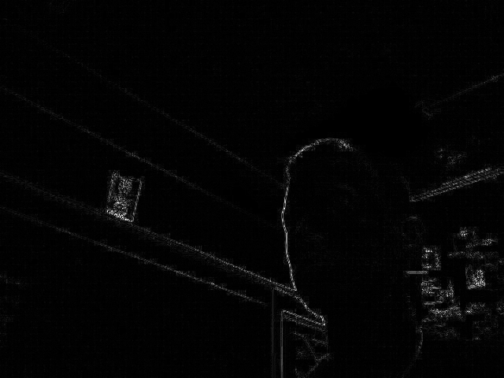
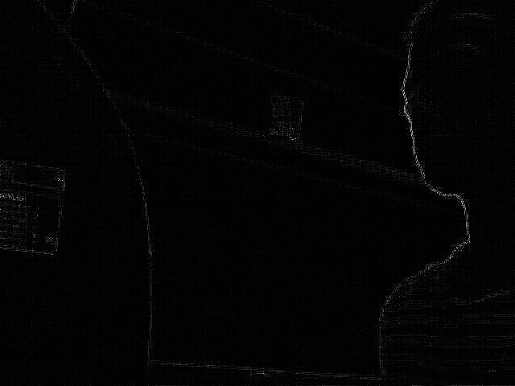

:toc: left
:source-highlighter: highlightjs

= Filtragem no Domínio Espacial I

Utilizando o código abaixo como referência, pretende-se implementar uma função que aplique os filtros gauss e laplaciano, exatamente nesta ordem, e exiba o resultado durante a captura de vídeo. O algoritmo abaixo já realiza ambas as funções, porém de forma separada. +
Pressionando a tecla "g" aplica-se o filtro de gauss e pressionando a tecla "l", o filtro do laplaciano.

O algoritmo base filtroespacial.cpp:

[source, C++]
----
#include <iostream>
#include <opencv2/opencv.hpp>

using namespace cv;
using namespace std;

void printmask(Mat &m){
  for(int i=0; i<m.size().height; i++){
    for(int j=0; j<m.size().width; j++){
      cout << m.at<float>(i,j) << ",";
    }
    cout << endl;
  }
}

void menu(){
  cout << "\npressione a tecla para ativar o filtro: \n"
	"a - calcular modulo\n"
    "m - media\n"
    "g - gauss\n"
    "v - vertical\n"
	"h - horizontal\n"
    "l - laplaciano\n"
	"esc - sair\n";
}

int main(int argvc, char** argv){
  VideoCapture video;
  float media[] = {1,1,1,
				   1,1,1,
				   1,1,1};
  float gauss[] = {1,2,1,
				   2,4,2,
				   1,2,1};
  float horizontal[]={-1,0,1,
					  -2,0,2,
					  -1,0,1};
  float vertical[]={-1,-2,-1,
					0,0,0,
					1,2,1};
  float laplacian[]={0,-1,0,
					 -1,4,-1,
					 0,-1,0};

  Mat cap, frame, frame32f, frameFiltered;
  Mat mask(3,3,CV_32F), mask1;
  Mat result, result1;
  double width, height, min, max;
  int absolut;
  char key;
  
  video.open(0); 
  if(!video.isOpened()) 
    return -1;
  width=video.get(CV_CAP_PROP_FRAME_WIDTH);
  height=video.get(CV_CAP_PROP_FRAME_HEIGHT);
  std::cout << "largura=" << width << "\n";;
  std::cout << "altura =" << height<< "\n";;

  namedWindow("filtroespacial",1);

  mask = Mat(3, 3, CV_32F, media); 
  scaleAdd(mask, 1/9.0, Mat::zeros(3,3,CV_32F), mask1);
  swap(mask, mask1);
  absolut=1; // calcs abs of the image

  menu();
  for(;;){
    video >> cap; 
    cvtColor(cap, frame, CV_BGR2GRAY);
    flip(frame, frame, 1);
    imshow("original", frame);
    frame.convertTo(frame32f, CV_32F);
    filter2D(frame32f, frameFiltered,
			 frame32f.depth(), mask, Point(1,1), 0);
    if(absolut){
      frameFiltered=abs(frameFiltered);
    }
    frameFiltered.convertTo(result, CV_8U);
    imshow("filtroespacial", result);
    key = (char) waitKey(10);
    if( key == 27 ) break; // esc pressed!
    switch(key){
    case 'a':
	  menu();
      absolut=!absolut;
      break;
    case 'm':
	  menu();
      mask = Mat(3, 3, CV_32F, media);
      scaleAdd(mask, 1/9.0, Mat::zeros(3,3,CV_32F), mask1);
      mask = mask1;
      printmask(mask);
      break;
    case 'g':
	  menu();
      mask = Mat(3, 3, CV_32F, gauss);
      scaleAdd(mask, 1/16.0, Mat::zeros(3,3,CV_32F), mask1);
      mask = mask1;
      printmask(mask);
      break;
    case 'h':
	  menu();
      mask = Mat(3, 3, CV_32F, horizontal);
      printmask(mask);
      break;
    case 'v':
	  menu();
      mask = Mat(3, 3, CV_32F, vertical);
      printmask(mask);
      break;
    case 'l':
	  menu();
      mask = Mat(3, 3, CV_32F, laplacian);
      printmask(mask);
      break;
    default:
      break;
    }
  }
  return 0;
}
----

Aplicando os filtros numa imagem qualquer, em tons de cinza, temos os efeitos:

Com o filtro gaussiano:

:imagesdir:

.Resultado da aplicação do filtro gaussiano.

Com o filtro laplaciano:

.Resultado da aplicação do filtro laplaciano.

A diferença entre as duas imagens, Figure 1 e Figure 2, é imensa. O filtro laplaciano faz detecção de contornos da imagem, enquanto que o filtro de gauss elimina alguns ruídos fazendo uma média da imagem. O resultado do filtro gauss+laplaciano pode ser visto na imagem a seguir:

.Resultado da aplicação do filtro de gauss seguido do filtro laplaciano.

É possível observar que a aplicação de ambos os filtros retorna uma resultado próximo do obtido com a Figure 2, laplaciano. No entanto, a aplicação de gauss com laplaciano ressalta melhor os tons de cinza dos contornos da imagem ao mesmo tempo que reduz a nitidez destes.

O algoritmo implementado está descrito a seguir e acrescenta uma tecla, "p", para a chamada dessa filtragem.

.Algoritmo implementado, laplgauss.cpp.

[source, C++]
----

----
