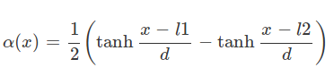
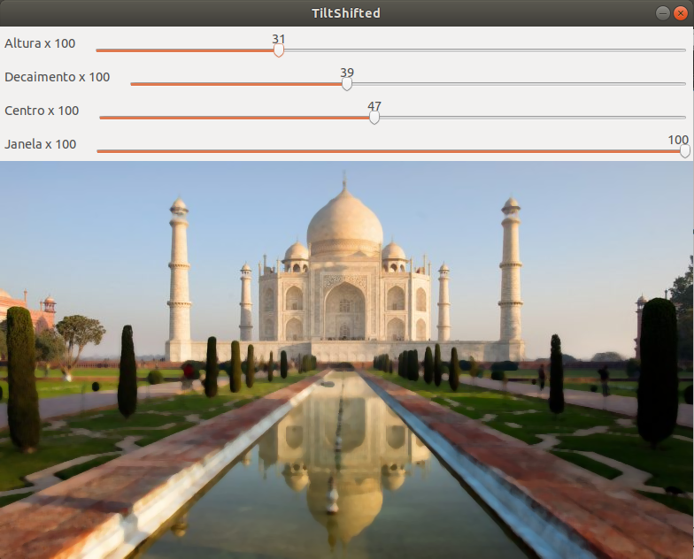

:toc: left
:source-highlighter: highlightjs

= Filtragem no Domínio Espacial II

A proposta deste exercício é implementar um programa que realize um _tiltshift_ numa imagem inserida. Esse efeito também deve ser alterado a partir de _trackbars_ até que o efeito desejado seja alcançado. Foram criadas 4 _trackbars_: Altura, decaimento, centro e janela. Esses parâmetros definem o valor do ganho alfa utilizado para gerar o efeito do _tiltshift_.

O efeito do _tiltshift_ é alçando através de um ponderamento entre a soma da imagem borrada pela média e a imagem original. A imagem original é ponderam por um alfa, dado abaixo, enquanto que a média é ponderada por 1-alfa.

Fórmula de alfa:

:imagesdir:

.Alfa para efeito de _tiltshift_.

O parâmetro janela altera a distância entre o l1 e o l2, mostrados na fórmula. Já o decaimento muda a velocidade com que a função cresce ou decresce, é o d da equação. O parâmetro altura é o ganho que multiplica a diferença das tangentes hiperbólicas. E o centro centraliza onde ficará os limites do efeito gerado.

O algoritmo pensado é o tiltshift.cpp:

[source, C++]
----
#include <iostream>
#include <stdio.h>
#include <cmath>
#include <opencv2/opencv.hpp>

using namespace cv;
using namespace std;

double janela = 0;
double alfa = 0;
float alpha = 0;
double decaimento = 0;
double altura = 0;
double pos1 = 0;
double pos2 = 0;

int width, height, width1, height1, width2, height2;

int janela_slider = 0;
int janela_slider_max = 100;

int altura_slider = 0;
int altura_slider_max = 100;

int decaimento_slider = 0;
int decaimento_slider_max = 100;

int pos1_slider = 0;
int pos1_slider_max = 100;

Mat image = imread("taj.jpg"), media(image.rows,image.cols,CV_32FC3);
Mat tilt = Mat::zeros(image.rows,image.cols,CV_32FC3);
Mat pond1 = Mat::zeros(image.rows,image.cols,CV_32FC3);
Mat pond2 = Mat(image.rows,image.cols,CV_32FC3, Scalar(1,1,1)); 
Mat shift1(image.rows,image.cols,CV_32FC3,Scalar(0,0,0)), shift2(image.rows,image.cols,CV_32FC3,Scalar(0,0,0));
Vec3f foco, semfoco; 

char TiltShift[50];

//calcula o coeficiente alfa para as matrizes de ponderação
void ponderacao(int, void*){

 altura = (double) altura_slider/(10*altura_slider_max);
 decaimento = (double) decaimento_slider*100/decaimento_slider_max;
 pos1 = (double) pos1_slider*(height/2)/pos1_slider_max;
 janela = (double) janela_slider*100/janela_slider_max;
 pos2 = pos1 + janela;

	for(int x =0 ; x<height; x++){
		alfa = 0.5*(tanh((x-pos1)/decaimento) -tanh((x-pos2)/decaimento));
		for(int y =0; y<width; y++){
			foco[0] = alfa;
			semfoco[0] = 1-alfa;
			foco[1] = alfa;
			semfoco[1] = 1-alfa;
			foco[2] = alfa;
			semfoco[2] = 1- alfa;
			pond1.at<Vec3f>(x,y) = foco;
			pond2.at<Vec3f>(x,y) = semfoco;
		}
	}

  multiply(image, pond1, shift1, 1, -1);

  multiply(media, pond2, shift2, 1, -1);

 tilt = shift1 + shift2;
 tilt.convertTo(tilt, CV_8UC3);
 imshow("TiltShifted", tilt); 

}

int main(){

  width=image.size().width;
  height=image.size().height;

  image.convertTo(image, CV_32FC3);

  medianBlur(image, media, 5);

  namedWindow("TiltShifted", 1);
  
  sprintf( TiltShift, "Altura x %d", altura_slider_max );

  createTrackbar( TiltShift, "TiltShifted",
				  &altura_slider,
				  altura_slider_max,
				  ponderacao );

  ponderacao(altura_slider,0);

 
  sprintf( TiltShift, "Decaimento x %d", decaimento_slider_max );
  createTrackbar( TiltShift, "TiltShifted",
				  &decaimento_slider,
				  decaimento_slider_max,
				  ponderacao );
  ponderacao(decaimento_slider,0);
  
  sprintf( TiltShift, "Centro x %d", pos1_slider_max );
  createTrackbar( TiltShift, "TiltShifted",
				  &pos1_slider,
				  pos1_slider_max,
				  ponderacao  );
  ponderacao(pos1_slider,0);

  sprintf( TiltShift, "Janela x %d", janela_slider_max );
  createTrackbar( TiltShift, "TiltShifted",
				  &janela_slider,
				  janela_slider_max,
				  ponderacao  );
  ponderacao(janela_slider,0);

  waitKey(0);
  imwrite("foto.jpg",tilt);
  return 0;
}
----

Como resultado temos a Figure 2, com a aplicação dos 4 parâmetros definidos na Figure 4. A imagem original pode ser visualizada na Figure 3, para fins de comparação.

Saída do algoritmo de _tiltshift_:

:imagesdir:

.Faixa de TiltShift.

.Imagem original do Taj Mahal.

Os 4 parâmetros utilizados para se gerar a Figure 1:

.Parâmetros do _tiltshift_.

É possível notar que existe uma faixa que centraliza a entrada da estrutura do Taj Mahal, na qual a imagem está bem mais definida, mais nítida, enquanto que fora dessa faixa existe um borramento que vai sendo mais acentuado a medida que de afasta da faixa.

