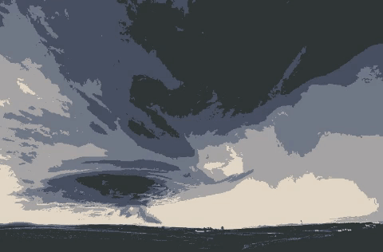

:toc: left
:source-highlighter: highlightjs

= Quantização Vetorial com K-means

Esse assunto refere-se ao agrupamento de objetos em determinados _clusters_. O algoritmo para se criar um _cluster_ é explicado da seguinte forma:

1. Selecionar a partir de alguma estratégia um determinado número de elementos (centros), tendo em vista que já se deve possuir um número de elementos e, que o número de centros colhido é menor que o número total de elementos.
2. Alguma relação é calculada entre esses elementos e os centros, normalmente é a distância euclidiana.
3. Os elementos são agrupados de acordo com a relação assumida. Para a distância euclidiana, agrupa-se os elementos num determinado _cluster_ aqueles que possuem menor distância com o centro calculado.
4. Após os elementos terem os seus _clusters_ calcula-se o centro de massa do grupo. Ou seja, o centro do _cluster_ que antes era um elemento escolhido agora será um valor calculado a partir das posições de todos os elementos daquele _cluster_.
5. Recalcula-se a distância de todos os elementos em relação a todos os _clusters_. Nesse momento, algum elemento pode trocar de grupo. Caso isto aconteça, o grupo foi alterado.
6. Quando um grupo é alterado, um elemento entra ou sai, deve-se recalcular todos os centros de massa novamente e a partir desse ponto volta-se para o passo 2 e repete-se o algoritmo até que alguma condição previamente estabelecida seja satisfeita, como um determinado número de iterações ou uma alteração mínimo menor do que um valor de "erro" estabelecido.

A _clusterização_ é o processo que é implementado pelo algoritmo kmeansrandom.cpp abaixo.

[source, C++]
----

#include <opencv2/opencv.hpp>
#include <cstdlib>

using namespace cv; 
using namespace std;

int main(){
  int nClusters = 5;
  Mat rotulos;
  int nRodadas = 1, iteracoes = 100;
  double erro = 0.01;
  Mat centros;
  
  Mat img = imread("furacao.jpg");
  Mat samples(img.rows * img.cols, 3, CV_32F);

  for( int y = 0; y < img.rows; y++ ){
    for( int x = 0; x < img.cols; x++ ){
      for( int z = 0; z < 3; z++){
        samples.at<float>(y + x*img.rows, z) = img.at<Vec3b>(y,x)[z];
	  }
	}
  }
  
  kmeans(samples,
		 nClusters,
		 rotulos,
		 TermCriteria(CV_TERMCRIT_ITER|CV_TERMCRIT_EPS, iteracoes, erro),
		 nRodadas,
		 KMEANS_RANDOM_CENTERS,
		 centros );
	cout << centros.rows << " x " << centros.cols << endl;

  Mat rotulada( img.size(), img.type() );
  for( int y = 0; y < img.rows; y++ ){
    for( int x = 0; x < img.cols; x++ ){ 
	  int indice = rotulos.at<int>(y + x*img.rows,0);
	  rotulada.at<Vec3b>(y,x)[0] = (uchar) centros.at<float>(indice, 0);
	  rotulada.at<Vec3b>(y,x)[1] = (uchar) centros.at<float>(indice, 1);
	  rotulada.at<Vec3b>(y,x)[2] = (uchar) centros.at<float>(indice, 2);
	}
  }
  imshow("clustered image", rotulada);
  imwrite("cluster10.jpg", rotulada);
  waitKey( 0 );
}

----

Este algoritmo irá implementar o procedimento descrito acima começando com amostras aleatórias no passo 1, devido a escolha do método "KMEANS_RANDOM_CENTERS". O número de iterações que o programa irá recalcular os centros de massa é definido na variável "iteracoes" e o "erro" inclui a condição de caso os centros de massa não alterarem sua posição até esse limite, então o algoritmo interrompe sua execução.

Como trabalhamos com imagens, esse efeito do K-means pode ser visualizado a partir do agrupamento das cores da imagem. Assim, no algoritmo, alguns valores RGB, presentes na imagem, são escolhidos aleatoriamente e todos os valores de distância dos elementos da matriz são calculados, sendo esses agrupados nos grupos definidos aleatoriamente. Em seguida, os centros de massa e todas as distâncias são calculados e recalculados um número de vezes igual a _iteracoes_. O número de _clusters_ pode ser modificado na variável "nClusters".

Foram geradas 10 imagens relativamente diferentes a partir do algoritmo acima e da imagem de entrada (Figura 1) para ilustrar os centros de massa calculados de forma aleatória. Essas imagens foram aglomeradas num GIF que pode ser visto na Figura 2.

:imagesdir:

.Imagem original, usada como entrada do algoritmo.

.Efeito da escolha aleatória dos centros de massa para partida do algoritmo K-means.

