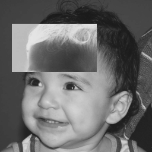

:toc: left
:source-highlighter: highlightjs

= Manipulação de Pixels

== *Problema 1:*

Esse exercício consiste em fazer a inversão de tonalidade de cinza da imagem base, "Biel.png".

:imagesdir: 

.Biel.png usado como entrada do programa.

image::biel.png[Biel]

O programa tem como entrada a imagem da Figure 1 e os parâmetros das regiões que se deseja realizar o negativo. Ou seja, o programa pede quatro coordenadas, que devem estar compreendidas entre 0 e 255, em valores inteiros, por se tratar da posição dos pixels. Caso seja necessário realizar o negativo de toda a imagem basta inserir os pontos (0,255) tanto para o ponto 1 quanto para o ponto 2. A operação realizada pelo algoritmo é apenas a subtração do valor original do pixel de 255.

Programa regions.cpp que realiza o negativo:

[source,C++]
----
#include <iostream>
#include <opencv2/opencv.hpp>

using namespace cv;
using namespace std;

int main(int, char**){

  int p1x = 0, p1y = 0, p2x = 0, p2y = 0;
  char aux; 
  Mat image;
  image = imread("biel.png",CV_LOAD_IMAGE_GRAYSCALE);

  cout << "Insira duas coordenadas para o ponto P1: " << endl;
  cout << "P1x: ";
  cin >> p1x;
  cout << "P1y: ";
  cin >> p1y;
  cout << "Insira duas coordenadas para o ponto P2: " << endl;
  cout << "P2x: ";
  cin >> p2x;
  cout << "P2y: ";
  cin >> p2y;

  for(int i= p1x; i<= p2x;i++){
    for(int j= p1y; j<= p2y; j++){
    aux = image.at<uchar>(i,j);
    image.at<uchar>(i,j) = 255 - aux;	
    }
  }
  imshow("image", image);
  imwrite("negativo.png",image);
  waitKey();
  return 0;
}

----

A saída do programa é a Figure 2, para o caso de se realizar o negativo em apenas uma região:

.Saída do programa regions.cpp. 

== *Problema 2:* 

Agora, a problemática consiste em realizar a troca das regiões da mesma imagem base, da Figure 1. No caso, o programa deve gerar uma saída como na Figure 3. O algoritmo trocaregioes.cpp está descrito a seguir:

[source, C++]
----
#include <iostream>
#include <opencv2/opencv.hpp>

using namespace cv;
using namespace std;

void troca(Mat &original)
{

Mat parte(256,256,CV_8UC1, Scalar(0));
	
	int i, j;
	for(i = 0; i <= 127; i++){
	
		for(j = 0; j <= 127; j++){
			
			parte.at<uchar>(i,j) = original.at<uchar>(i+128,j+128);
		}
		}
	
	for(i = 0; i <= 127; i++){
		for(j = 128; j <= 255; j++){
		parte.at<uchar>(i,j) = original.at<uchar>(i+128,j-128);
		}
	}
	
	for(i = 128; i <= 255; i++){
		for(j = 0; j <= 127; j++){
		parte.at<uchar>(i,j) = original.at<uchar>(i-128,j+128);
		}
	}

	for(i = 128; i <= 255 ; i++){
		for(j = 128; j <= 255; j++){
		parte.at<uchar>(i,j) = original.at<uchar>(i-128,j-128);
		}
	} 
	imshow("trocado", parte);
	imwrite("trocado.png", parte);
}

int main(){

  Mat image;
  
  image = imread("biel.png",CV_LOAD_IMAGE_GRAYSCALE);
	if(!image.data)
		cout << "Não abriu a imagem" << endl;
  troca(image);

  imshow("original", image);

  waitKey();
  return 0;
}
----

.Troca dos quadrantes da Figure 1.

image::trocado.png[Trocado]

Existem funções no OpenCV que auxiliam a realização dessa troca de quadrantes de uma imagem, mas o algoritmo acima trabalha mais fortemente a noção dos pixels, como é a proposta do tema destes projetos. Assim, é necessário saber onde começa cada quadrante, por exemplo, o quadrante 1, começando da origem (normal) da imagem, inicia no pixel i = 0 e j = 0, e termina no pixel i = 127 e j = 127; já o quadrante 4 inicia no pixel i = 128 e j = 128, e termina no pixel i = 255 e j= 255.

