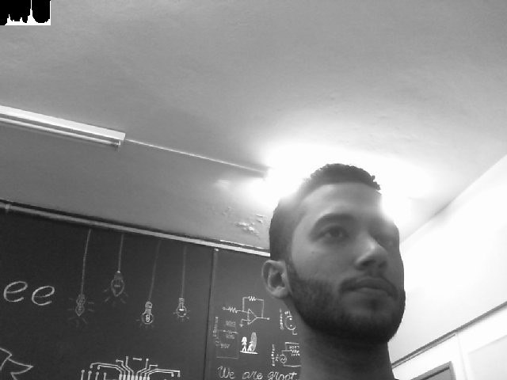
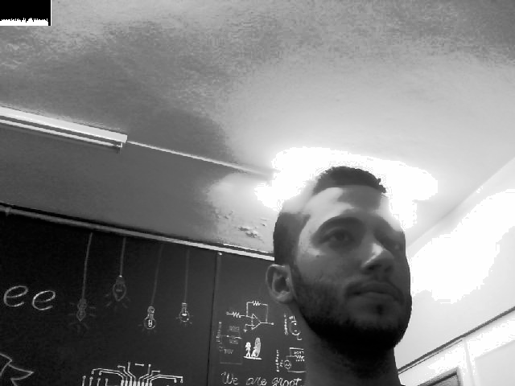

= Manipulação de Histogramas

== *Problema 1:*

O código abaixo, equalizacao.cpp, utiliza uma câmera webcam, e portanto, uma nova classe do OpenCV, VideoCapture. O algoritmo irá realizar a equalização (melhor distribuição do histograma pelo spectro de tons) das imagens em tons de cinza capturadas pela webcam, frame a frame, e exibir o histograma dessas imagens juntamente da imagem equalizada. Como exemplo, temos a Figure 1, antes da equalização, apenas a imagem capturada pela câmera em tons de cinza.

:imagesdir:

.Imagem normal, em tons de cinza.

Observe que o histograma, no canto superior esquerdo, apresenta algumas elevações desproporcionais el alguns pontos, ou seja, alguns picos. A Figure 2 é a imagem equalizada pelo algoritmo equalizacao.cpp.

.Imagem equalizada.

Em contraste com a Figure 1, o histograma da Figure 2 é bem mais constante, sem a presença dos picos mencionados. Também é fácil observar a distorção nos detalhes muito claros na imagem, causados pela função de equalização. Em alguns pontos é possível ver os pixels mais claros.

As principais funções do OpenCV utilizadas foram: _equalizeHist_ que realiza a equalização da imagem e _calcHist_ que calcula o histograma da imagem. A função cvtColor realiza a conversão da imagem com tons em RGB para tons de cinza.

O Programa equalizacao.cpp:

[source, C++]
----
#include <iostream>
#include <opencv2/opencv.hpp>

using namespace cv;
using namespace std;

int main(int argc, char** argv){
  Mat image, cinza(256,256,CV_8U), equalized(256,256,CV_8U);
  int width, height;
  VideoCapture cap;
  Mat histC(64,64,CV_8U), equa(64,64,CV_8U);
  int nbins = 64, channel = 0;
  float range[] = {0, 256};
  const float *histrange = { range };
  bool uniform = true;
  bool acummulate = false;

  cap.open(0);
  
  if(!cap.isOpened()){
    cout << "cameras indisponiveis" << endl;
    return -1;
  }
  
  width  = cap.get(CV_CAP_PROP_FRAME_WIDTH);
  height = cap.get(CV_CAP_PROP_FRAME_HEIGHT);

  cout << "largura = " << width << endl;
  cout << "altura  = " << height << endl;
  
  int histw = nbins, histh = nbins/2;
  Mat histImgC(histh, histw, CV_8U, Scalar(0));
  Mat histEquC(histh, histw, CV_8U, Scalar(0));

  namedWindow("Histograma",WINDOW_AUTOSIZE);

  while(waitKey(30)!=32){
    cap >> image;
	cvtColor(image,cinza,CV_BGR2GRAY);

	equalizeHist(cinza, equalized);

	calcHist(&cinza,1,0,Mat(),histC,1,&nbins,&histrange,uniform,acummulate);  //Histograma para imagem cinza normal
	normalize(histC, histC, 0, histImgC.rows, NORM_MINMAX, -1, Mat());
  	histImgC.setTo(Scalar(0));

	calcHist(&equalized,1,0,Mat(),equa,1,&nbins,&histrange,uniform,acummulate); //Histograma para imagem cinza equalizada
	normalize(equa, equa, 0, histImgC.rows, NORM_MINMAX, -1, Mat());
  	histEquC.setTo(Scalar(0));

	for(int i=0; i<nbins; i++){
      line(histImgC,
           Point(i, histh),
           Point(i, histh-cvRound(histC.at<float>(i))),
           Scalar(255), 1, 8, 0);
    }

	histImgC.copyTo(cinza(Rect(0, 0,nbins, histh)));
	imshow("Histograma", cinza);

	for(int i=0; i<nbins; i++){
      line(histEquC,
           Point(i, histh),
           Point(i, histh-cvRound(equa.at<float>(i))),
           Scalar(255), 1, 8, 0);
    }

	histEquC.copyTo(equalized(Rect(0, 0,nbins, histh)));
     	imshow("Equalizado", equalized);

    imshow("image", image);
    if(waitKey(30) == 'f'){
	imwrite("equalizado.png", equalized);
	imwrite("cinza.png", cinza);
	}
  }
  return 0;
}
----

== *Problema 2:*
