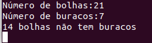

= Preenchimento de Regiões

== *Problema 1:*

O programa descrito em labeling.cpp (logo em seguida), usado como base para exercícios que envolvem o preenchimento de regiões, contém um pequeno problema. Devido a sua limitação de exibição de tonalidades de cinza destinguíveis para o ser humano, caso a imagem apresenta mais de 255 objetos, esse algoritmo não poderá rotular todos eles devido o spectro de visualização desses tons ser limitado em 255. 

A proposta é adaptar o algoritmo para o sistema RGB, assim haverá 16581375 (255³) de rótulos possíveis.

Programa labeling.cpp:

[source,C++]
----
#include <iostream> 	
#include <opencv2/opencv.hpp>

using namespace cv;

int main(int argc, char** argv){
  Mat image, mask;
  int width, height;
  int nobjects;
  
  CvPoint p;
  image = imread(argv[1],CV_LOAD_IMAGE_GRAYSCALE);
  
  if(!image.data){
    std::cout << "imagem nao carregou corretamente\n";
    return(-1);
  }
  width=image.size().width;
  height=image.size().height;

  p.x=0;
  p.y=0;

  // busca objetos com buracos presentes
  nobjects=0;
  for(int i=0; i<height; i++){
    for(int j=0; j<width; j++){
      if(image.at<uchar>(i,j) == 255){
		// achou um objeto
		nobjects++;
		p.x=j;
		p.y=i;
		floodFill(image,p,nobjects);
	  }
	}
  }
  imshow("image", image);
  imwrite("labeling.png", image);
  waitKey();
  return 0;
}

----

== *Problema 2:* 

Utilizando o mesmo programa labeling.cpp como base, uma nova versão, cap3.cpp, irá remover as bolhas das bordas da imagem e contar o número de bolhas e o número de buracos (pois nem todas as bolhas tem buracos, com a imagem em questão). O algoritmo utiliza a função "floodFill" do OpenCV que precisa de 3 argumentos. O primeiro é a imagem trabalhada, ou seja do tipo "Mat", o segundo o apontador do pixel, que pega as coordenadas dele em x e y, e por fim a tonalidade que se deseja aplicar ao rótulo.

A imagem utilizada como base para teste dos algoritmos é a Figure 1, que contém apenas tons de 0 (preto) ou 255 (branco).

:imagesdir: 

.Bolhas com e sem buracos.

image::bolhas.png[]

O algoritmo está descrito da seguinte forma:

[source,C++]
----
#include <iostream>
#include <opencv2/opencv.hpp>

using namespace cv;
using namespace std;

void limpaborda (Mat &imagem, int h, int w){
int i=0,j=0, cont2;
CvPoint z;
z.x = 0;
z.y = 0;

  for(cont2=1; cont2<=2; cont2++){ // retirando bolhas das linhas: 0 e 255;
	for(j=0; j<w; j++){
		if(imagem.at<uchar>(i,j) == 255){
		z.x = j;
		z.y = i;
		floodFill(imagem,z,0);		
		}
	}
	i = 255;
  }
  j = 0;
  for(cont2=1;cont2<=2; cont2++){ // retirando bolhas das colunas: 0 e 255;
	for(i=0; i<h; i++){
		if(imagem.at<uchar>(i,j) == 255){
		z.x = j;
		z.y = i;
		floodFill(imagem,z,0);		
		}
	}
	j = 255;
  }
}

void contaburaco (Mat &imagem, int h, int w){
int i=0,j=0, bolhas=0, buracos=0, margem=50; // margem: para efeito visual, diferenciar um tom do outro
CvPoint z;
z.x = 0;
z.y = 0;

  if(imagem.at<uchar>(i,j)==0){ // diferencia o fundo dos buracos das bolhas
	z.x = j;
	z.y = i;
	floodFill(imagem,z,margem);
  }

  namedWindow("função",WINDOW_AUTOSIZE);
  imshow("função", imagem);
	for(i=0; i < h; i++){
		for(j=0; j < w;j++){
		  if(imagem.at<uchar>(i,j) == 255){ // pinta o contorno da bolha com outro tom de cinza
		  z.x = j;
		  z.y = i;
		  floodFill(imagem,z,2*margem);
		  bolhas++;
		  }
		  if(imagem.at<uchar>(i,j) == 0){ // pinta o buraco com outro tom de cinza
		  cout << "entrei" << endl;
		  z.x = j;
		  z.y = i;
		  floodFill(imagem,z,3*margem);
		  buracos++;
		  }		
		}
	}
  cout << "Número de bolhas:" << bolhas << endl;
  cout << "Número de buracos:" << buracos << endl;
  cout << bolhas - buracos <<" bolhas não tem buracos" << endl;
}

int main(){
  Mat image, copy;
  int height, width;

  image= imread("bolhas.png",CV_LOAD_IMAGE_GRAYSCALE);
  if(!image.data)
    cout << "nao abriu bolhas.png" << endl;
  namedWindow("janela",WINDOW_AUTOSIZE);

  height = image.size().height;
  width = image.size().width;
  copy.create(height,width,CV_8U);

  limpaborda(image, height, width);

  contaburaco(image, height, width);

  imshow("janela", image); 
  
  waitKey();
  return 0;
}

----

O algoritmo cap3.cpp inicialmente chama uma função, chamada de "limpaborda", que irá remover, como já comentado, as bolhas das bordas da imagem, utilizando a função _floodFill_ do OpenCV, que ao encontrar um pixel com tonalidade de 255 irá preencher a regiaõ com o valor 0. 

A saída gerada pela função limpaborda pode ser vista na Figure 2, para melhor visualização comparar com a Figure 1:

.Borda limpa, sem bolhas.

image::bordalimpa.png[]

Após as bordas estarem sem bolhas, o algoritmo chama outra função, nomeada como "contaburaco" que inicialmente pinta o fundo da imagem de cinza (tom com valor de 50), para diferenciarmos o buraco da bolha do fundo da imagem. A Figure 3 exibe essa diferenciação.

.Fundo com tom de cinza diferente de 0 para destaque dos buracos das bolhas.

image::fundo.png[]

Em seguida, a função irá contar a quantidade de vez que encontra um pixel com valor 0 (preto), aplicando uma outra tonalidade (valor de 150) com a função _floodFill_ para remover completamente o "buraco" de uma futura contagem pela varredura da imagem. De modo semelhante, o algoritmo conta a quantidade de vezes que encontra a borda branca da bolha (valor de 255), incrementando o contador de bolhas e preenchendo os pixels brancos com outra tonalidade de cinza, diferente do cinza dos buracos das bolhas (valor de 100). A imagem final gerada pelo programa é a Figure 4. Como saída do programa também temos o número de bolhas sem buracos e com buracos, Figure 5.

.Bolhas com buracos e sem buracos contabilizadas com outras tonalidades de cinza.

image::buracos.png[]

.Contagem do número de bolhas com e sem buracos pelo algoritmo.

